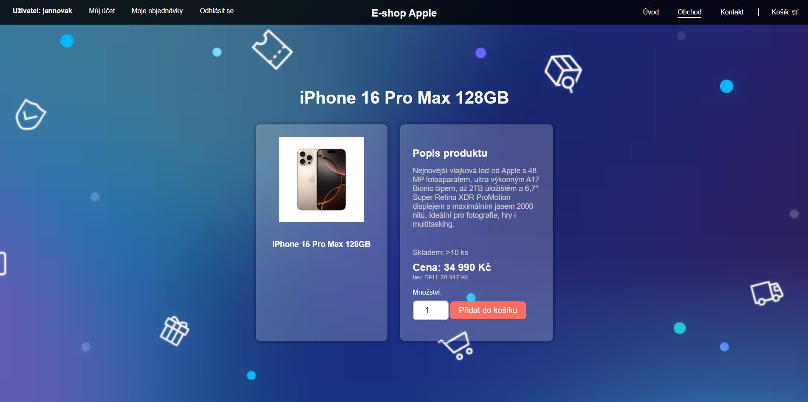
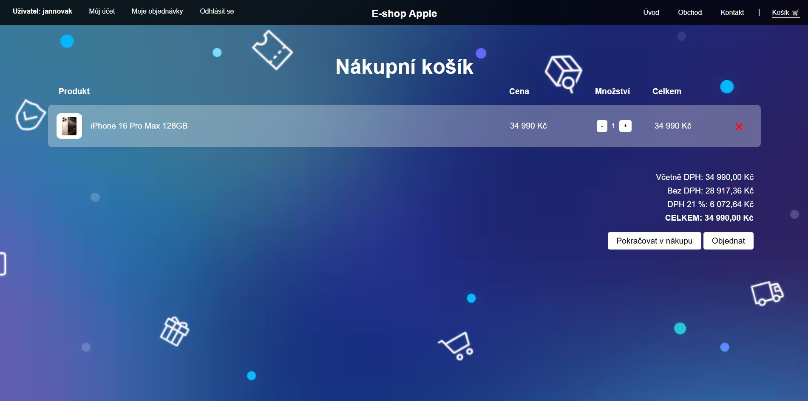
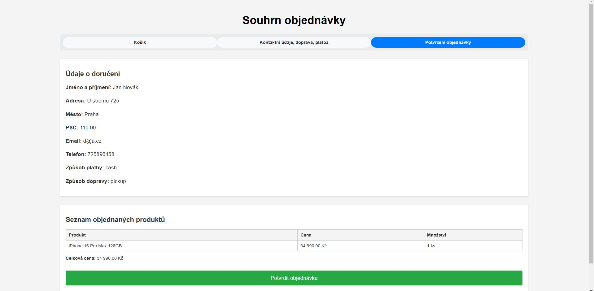
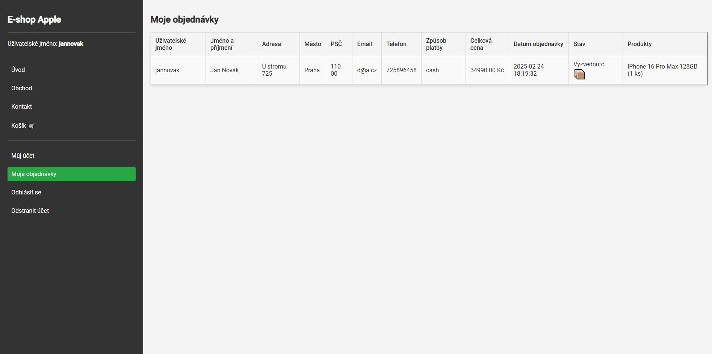
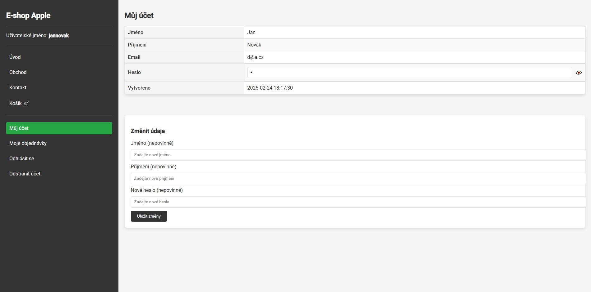
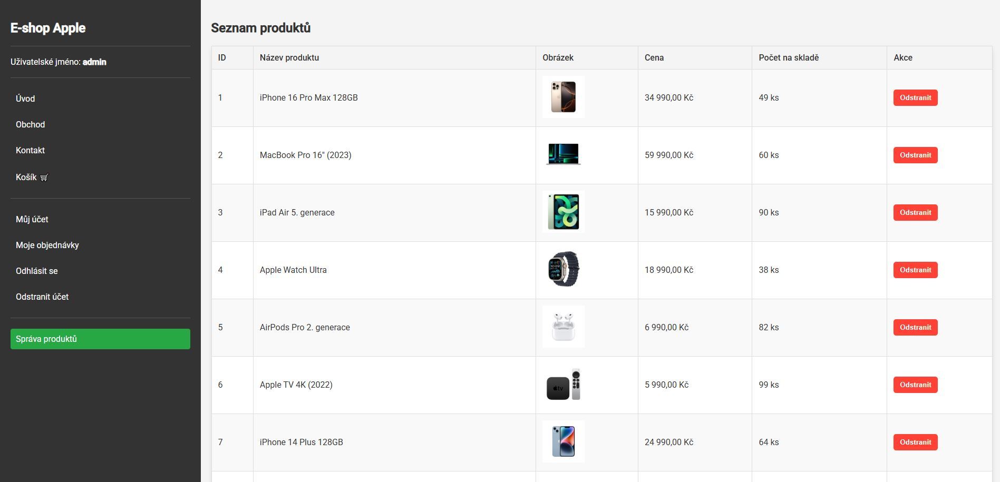
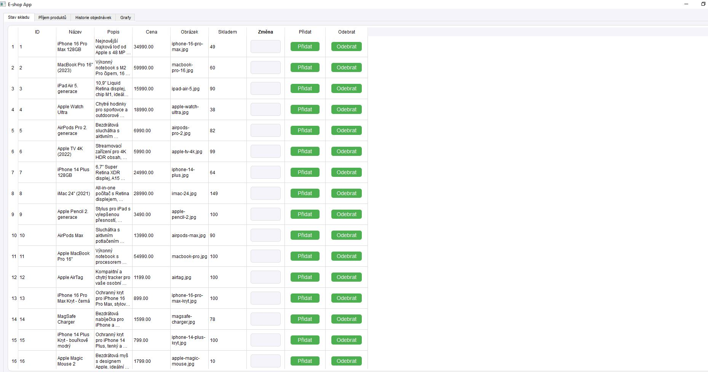

# E-shop Apple
[Návod na spuštění eshopu zde](navod.txt)


**1. Stručný popis programu, jeho funkce, ukázky použití**
>**Stručný popis programu**
- Tento e-shop zaměřený na produkty Apple umožňuje uživatelům prohlížet a vybírat produkty Apple, spravovat své objednávky a upravovat své uživatelské údaje. Uživatelé mohou zobrazit všechny své objednávky a upravovat například své jméno, příjmení či heslo. Administrátoři mají rozšířená práva, umožňující jim mazat produkty z webu a v aplikaci přidávat nové produkty, stejně jako upravovat skladové zásoby (přidávat nové kusy na sklad).

- Celý systém je propojen s databází MySQL, která obsahuje tabulky pro produkty, uživatele a objednávky. Aplikace komunikuje s touto databází, aby prováděla operace jako výběr produktů, správu uživatelských údajů a manipulaci se skladovými zásobami.
>**Funkce programu**
- Prohlížení produktů Apple:
  Uživatelé mohou procházet seznam produktů, který obsahuje názvy, popisy, ceny a obrázky.
- Výběr produktů a objednávky:
  Uživatelé si mohou vybrat produkty, přidat je do košíku a provést objednávku.
  Objednávky jsou uloženy v databázi a uživatelé mohou vidět historii svých objednávek.
- Správa uživatelských údajů:
  Uživatelé mohou upravit své osobní údaje (např. jméno, e-mail, heslo) a spravovat svůj účet.
- Správa produktů pro administrátory:
  Administrátoři mohou přidávat nové produkty do systému a upravovat jejich detaily (např. název, cena, popis, obrázek).
  Administrátoři mohou mazat produkty z nabídky e-shopu.
- Správa skladových zásob:
  Administrátoři mohou přidávat nové kusy produktů na sklad (např. přidání +10 kusů konkrétního produktu).
- Komunikace s databází:
  Všechny informace (produkty, objednávky, uživatelské údaje) jsou uloženy v databázi MySQL.
  Aplikace provádí CRUD operace (vytváření, čtení, aktualizace, mazání) na tabulkách produktů, uživatelů a objednávek.
- Autentifikace uživatelů:
  Uživatelé se přihlašují do systému pomocí e-mailu a hesla.
  Správa přístupu k různým funkcím na základě role (uživatel vs. administrátor).
>**Ukázky použití**

**Obrázek č. 1 - Stránka eshopu s produkty (produkty se načítají z databáze)**

**Obrázek č. 2 - Stránka s produktem**

**Obrázek č. 3 - Košík s produktem**

**Obrázek č. 4 - Stránka se souhrnem objednávky**

**Obrázek č. 5 - Uživatelská část - objednávky uživatele**

**Obrázek č. 6 - Uživatelská část - osobbní údaje uživatele + možnost změny některých údajů**

**Obrázek č. 7 - Webová stránka pro admina, kde může mazat zboží (z databáze), které je na eshopu**

**Obrázek č. 8 - Aplikace, možnost přidání nebo odebrání kusů na skladě (komunikace s databází)**


**2. Seznam použitých algoritmů a knihoven**

**3. Seznam autorů**
- Ondřej Rendl

**4. Dokumentace kódu Python (minimálně dokumentace funkcí a tříd)**
>**1. Importy**
-  PyQt5.QtCore.QTimer: Slouží k časování.
-  pymysql: Používá se pro připojení a práci s MySQL databází.
-  PyQt5.QtWidgets: Obsahuje widgety jako QVBoxLayout, QPushButton, QTableWidget, atd.
-  matplotlib.pyplot: Slouží pro vytváření grafů.
-  matplotlib.backends.backend_qt5agg.FigureCanvasQTAgg: Používá se pro vykreslování grafů do Qt aplikace.

>**2. Připojení k databázi**
-  connection: Připojení k databázi pro produkty (eshop).
-  order_connection: Připojení k databázi pro objednávky (eshop).

>**3. Funkce pro práci s databází**
>**fetch_products()**
-  Popis: Načte všechny produkty z databáze.
-  Výstup: Seznam produktů jako tuple (id, název, popis, cena, obrázek, skladem).
>**insert_product(name, description, price, image, stock)**
-  Popis: Vloží nový produkt do databáze.
-  Parametry: name, description, price, image, stock – vlastnosti nového produktu.
>**fetch_orders()**
-  Popis: Načte všechny objednávky z databáze.
-  Výstup: Seznam objednávek jako tuple (id, jméno, adresa, město, PSČ, email, telefon, metoda platby, celková cena, datum objednávky, způsob dopravy, produkty).
>**fetch_last_10_orders()**
-  Popis: Načte posledních 10 objednávek.
-  Výstup: Seznam posledních 10 objednávek.

>**4. Hlavní třída aplikace App(QWidget)**
>**__init__(self)**
-  Popis: Inicializuje aplikaci, nastavuje vzhled a připojuje všechny widgety a layouty.
-  Tlačítka a layouty:
-  Tabulky: Tři tabulky pro zobrazení produktů, objednávek a grafů.
-  Záložky: Záložky pro "Stav skladu", "Příjem produktů", "Historii objednávek", a "Grafy".
>**update_table(self)**
-  Popis: Načte produkty z databáze a aktualizuje tabulku.
-  Popis práce: Pro každý produkt je vytvořen řádek v tabulce s hodnotami produktů a tlačítky pro přidání nebo odebrání kusů z inventáře.
>**update_orders_table(self)**
-  Popis: Načte objednávky z databáze a aktualizuje tabulku.
>**update_graph(self)**
-  Popis: Vykreslí graf s cenami posledních 10 objednávek.
-  Detail: Vykresluje sloupcový graf a zobrazuje zisk a průměrnou cenu objednávek.
>**download_orders(self)**
-  Popis: Umožňuje stáhnout objednávky do textového souboru.
>**create_add_button_function(self, row, quantity_input)**
-  Popis: Vytvoří funkci pro tlačítko "Přidat" pro daný produkt.
-  Funkčnost: Přidá zadané množství kusů na sklad.
>**create_subtract_button_function(self, row, quantity_input)**
-  Popis: Vytvoří funkci pro tlačítko "Odebrat" pro daný produkt.
-  Funkčnost: Odebere zadané množství kusů ze skladu.
>**add_quantity_to_product(self, product_id, quantity)**
-  Popis: Přidá specifikované množství k produktu.
>**subtract_quantity_from_product(self, product_id, quantity)**
-  Popis: Odebere specifikované množství od produktu.
>**add_product(self)**
-  Popis: Přidá nový produkt do databáze na základě údajů z formuláře.
-  Validace: Kontroluje, zda je cena číslo a skladem celé číslo.

>**5. Třída pro přihlášení LoginDialog(QDialog)**
>**__init__(self)**
-  Popis: Vytvoří okno pro přihlášení uživatele.
-  Komponenty: Uživatelské jméno, heslo, tlačítko pro přihlášení.
>**check_credentials(self)**
-  Popis: Ověří uživatelské jméno a heslo podle hodnot v souboru appreg.txt.
>**6. Spuštění aplikace**
-  Popis: Pokud uživatel úspěšně zadá přihlašovací údaje, otevře se hlavní okno aplikace, jinak se aplikace uzavře.


**5. ER-diagram databáze**

**6. Skripty pro tvorbu tabulek, vložení několika vzorových dat a získání vzorových dat z tabulek**
>**Skripty pro vytvoření hlavních databází**
-  Vytvoření databáze **users**
```sql
CREATE TABLE IF NOT EXISTS users (
    id INT AUTO_INCREMENT PRIMARY KEY,
    first_name VARCHAR(255) NOT NULL,
    last_name VARCHAR(255) NOT NULL,
    username VARCHAR(255) NOT NULL UNIQUE,
    email VARCHAR(255) NOT NULL UNIQUE,
    password VARCHAR(255) NOT NULL,
    created_at DATETIME DEFAULT CURRENT_TIMESTAMP
);
```
-  Vytvoření databáze **produkty**
```sql
CREATE TABLE IF NOT EXISTS produkty (
    id INT AUTO_INCREMENT PRIMARY KEY,
    nazev VARCHAR(255) NOT NULL,
    popis TEXT,
    cena DECIMAL(10,2) NOT NULL,
    obrazek VARCHAR(255),
    skladem INT NOT NULL DEFAULT 0
);
```
-  Vytvoření databáze **orders** (přidávat skripty na vytvoření databáze postupně)
```sql
CREATE TABLE `orders` (
  `id` int(11) NOT NULL,
  `username` varchar(255) DEFAULT NULL,
  `name` varchar(255) NOT NULL,
  `address` text NOT NULL,
  `city` varchar(100) NOT NULL,
  `zip` varchar(20) NOT NULL,
  `email` varchar(255) NOT NULL,
  `phone` varchar(20) NOT NULL,
  `payment_method` varchar(50) NOT NULL,
  `total_price` decimal(10,2) NOT NULL,
  `order_date` datetime DEFAULT current_timestamp(),
  `shipping_method` varchar(100) NOT NULL,
  `products` text NOT NULL
)
```
```sql
ALTER TABLE `orders`
  ADD PRIMARY KEY (`id`),
  ADD KEY `username` (`username`);
```
```sql
ALTER TABLE `orders`
  MODIFY `id` int(11) NOT NULL AUTO_INCREMENT, AUTO_INCREMENT=57;
```
```sql
ALTER TABLE `orders`
  ADD CONSTRAINT `orders_ibfk_1` FOREIGN KEY (`username`) REFERENCES `users` (`username`) ON DELETE CASCADE;
COMMIT;
```


**7. Úprava data v databázi (UPDATE, DELETE)**

  
